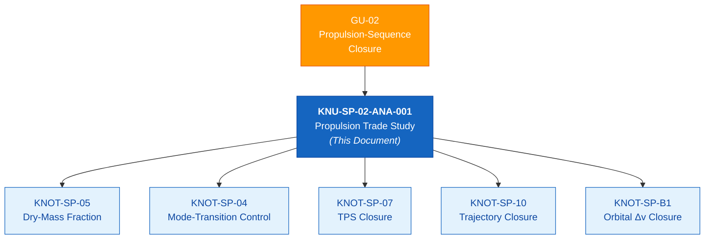
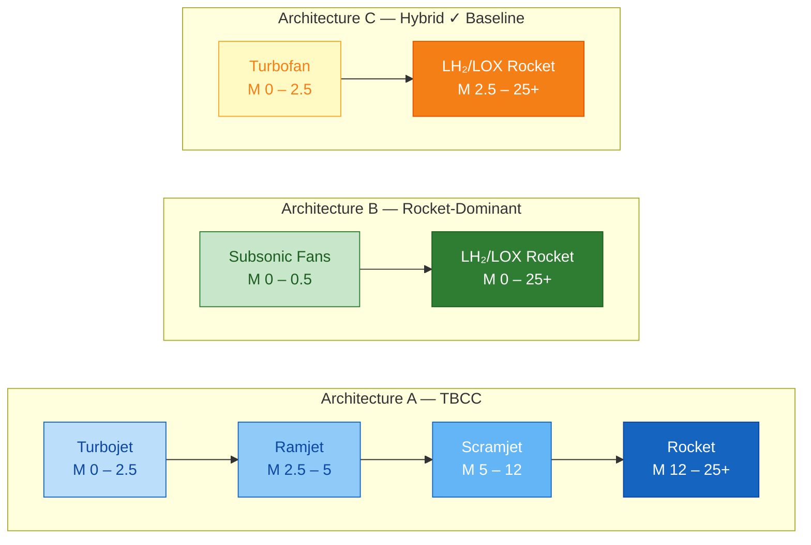
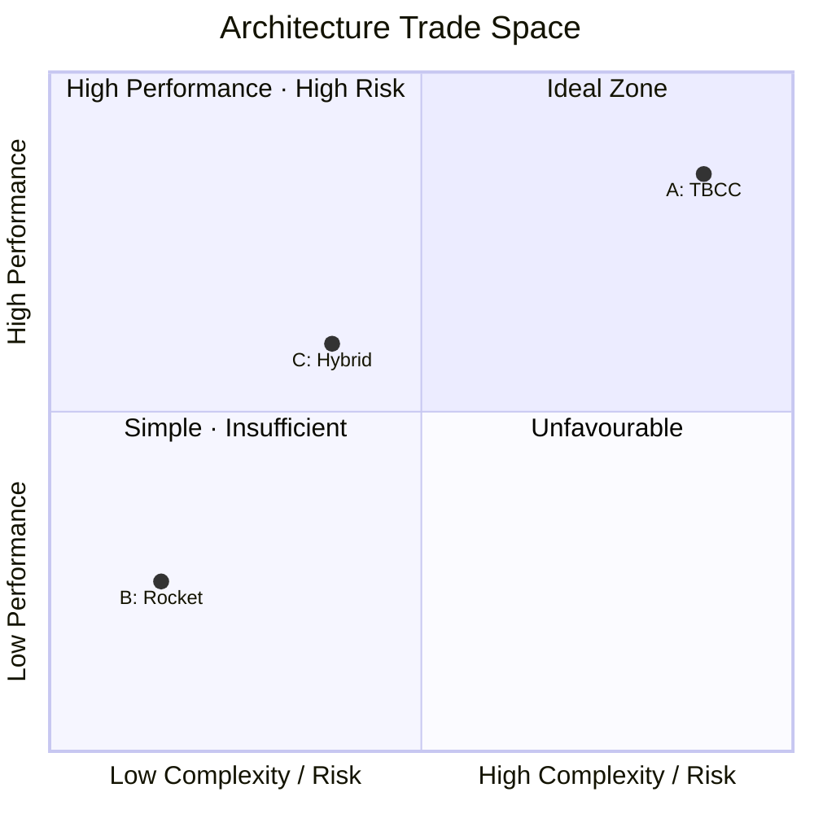
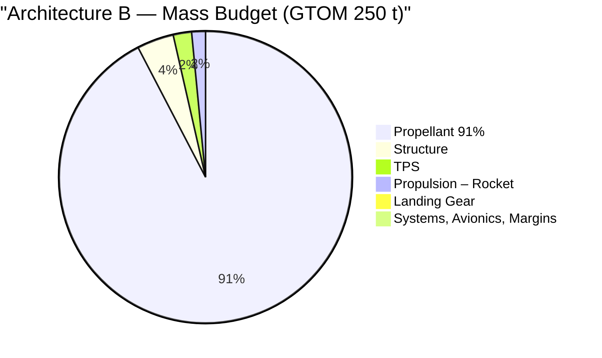
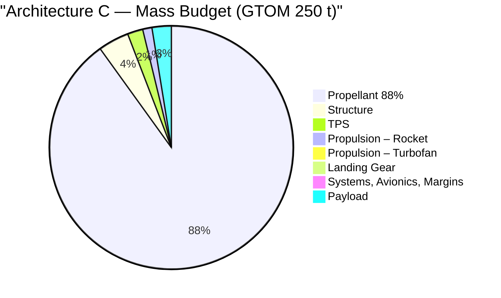
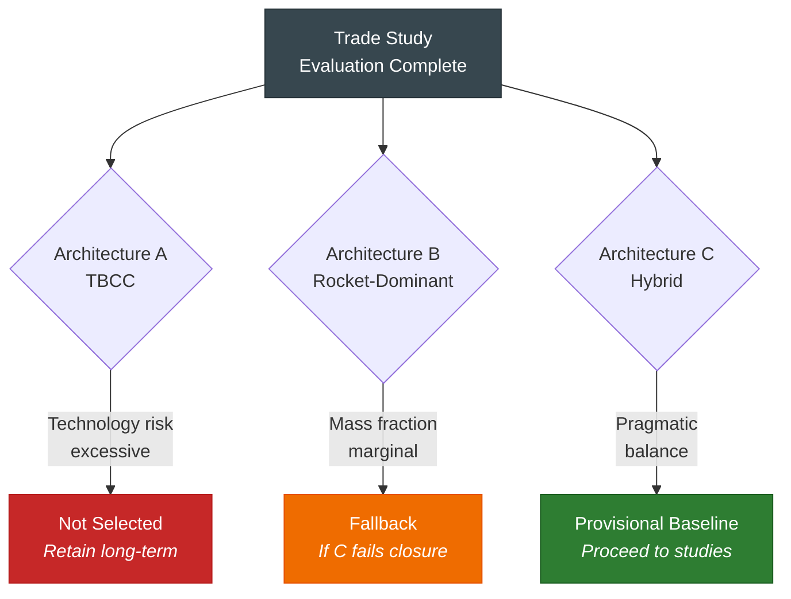
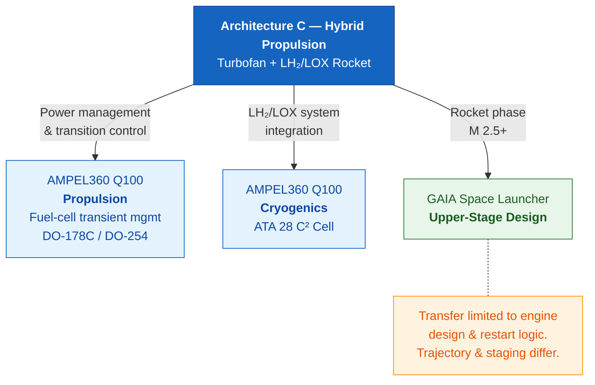
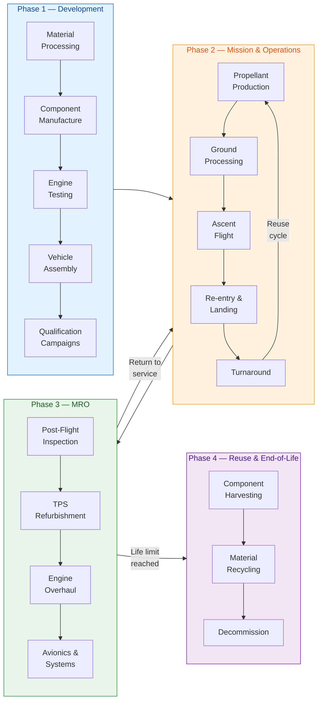
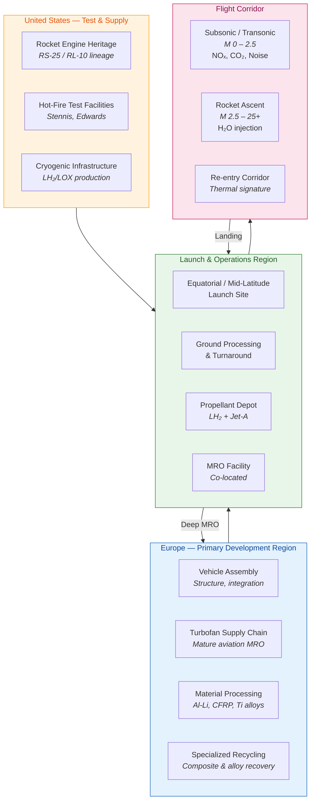
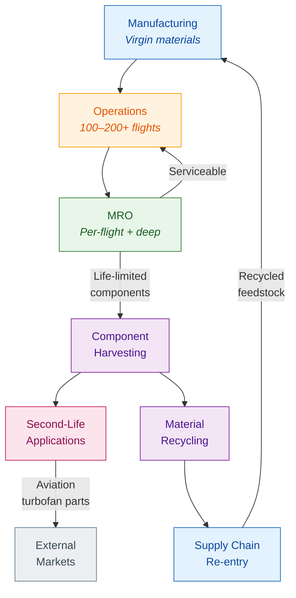

# Propulsion Architecture Trade Study
**Reusable Spaceplane — Combined-Cycle vs Rocket-Dominant vs Hybrid**

| Field | Value |
| :--- | :--- |
| **Document ID** | KNU-SP-02-ANA-001 |
| **Parent KNOT** | KNOT-SP-02: Propulsion-sequence closure |
| **GU Reference** | GU-02 |
| **KNU Type** | ANA (Screening Analysis) — Qualitative pre-model trade study |
| **Lifecycle Position** | Supports LC01/LC02 architecture screening; precedes LC05 model-based analyses |
| **MN Trace** | MN-01; MN-03; MN-10 |
| **Priority** | P0 (Programme-gate prerequisite) |
| **Owner** | STK_SE (Systems Engineering) |
| **Stakeholders** | STK_SAF; STK_CERT; STK_TEST |
| **Version** | 0.5 |
| **Date** | 2026-03-25 |
| **Status** | IN_REVIEW |

### Change Log

| Version | Date | Change |
| :--- | :--- | :--- |
| 0.1 | 2026-03-22 | Initial draft |
| 0.2 | 2026-03-22 | Incorporated review corrections: reclassified as screening trade; corrected terminology; revised Branch A verdict. |
| 0.3 | 2026-03-22 | Final review corrections: Corrected M ≤ 2.5 classification; added sensitivity indicators; softened analogues; expanded residual trajectory; tagged abort numbers as notional. |
| 0.4 | 2026-03-22 | **Final Polish:** Softened language in Section 1 (screening limitations); standardized mass breakdown line items in Sections 4.2/4.3; added GAIA spillover qualifier; restored Review & Approval table. |
| 0.5 | 2026-03-25 | Added Section 10 — ESG Real-Time Footprint (Huella) covering development, mission/operations, MRO, and reuse stages with regional impact mapping and architecture-specific sustainability assessment. |

---

## 1. Objective

This trade study evaluates three candidate propulsion architectures for a reusable spaceplane supporting **Hypersonic Point-to-Point Transport (Branch A)** and **Single-Stage-to-Orbit (Branch B)**. The architectures are assessed against propulsive performance, mass penalty, thermal compatibility, mode-transition risk, and branch-closure viability.

This is the first executed KNU in the feasibility programme, directly addressing **Governing Uncertainty GU-02 (Propulsion-Sequence Closure)**. The outcome determines whether the design space **may** contain an architecture capable of supporting both mission branches and identifies which option minimizes risk to the concept-fatal KNOTs: **KNOT-SP-05 (Dry-Mass Fraction Closure)** and **KNOT-SP-11 (Abort Coverage)**.

### 1.1 Artifact Classification
This document is a **qualitative screening trade study**. No computational models were executed. The purpose is architecture selection and non-viable option elimination, not performance prediction. Quantitative closure evidence will be produced by follow-on KNUs (ANA-002 through ANA-004), which constitute LC05 analysis-model artifacts.

### 1.2 Acceptance Criteria
Per the KNU_PLAN, this artifact is accepted when:
*   Three architectures have been assessed against Isp, mass, thermal, and mode-transition criteria.
*   Architectures are ranked with qualitative sensitivity indications and explicit downstream dependencies.
*   A provisional baseline recommendation is issued with traceability to downstream KNOTs.

### 1.3 Downstream Dependencies
The selected architecture constrains all subsequent analyses:
*   **KNOT-SP-05 (Dry-Mass Fraction Closure):** Propulsion mass is the largest single contributor to inert mass.
*   **KNOT-SP-04 (Mode-Transition Controllability):** Transition complexity is architecture-dependent.
*   **KNOT-SP-07 (TPS Closure):** Ascent trajectory and thermal environment are propulsion-dependent.
*   **KNOT-SP-10 (Trajectory Closure):** Isp schedule governs achievable trajectories.
*   **KNOT-SP-B1 (Orbital Delta-v Closure):** Propellant fraction and Isp determine payload capacity.

*Figure 1 — Downstream KNOT dependency graph. This trade study is the first resolution step for GU-02 and directly constrains five downstream closure nodes.*

---

## 2. Candidate Architectures

### 2.1 Architecture A — Turbine-Based Combined Cycle (TBCC)
**Description:** A variable-cycle turbojet/turbofan for Mach 0–2.5, transitioning to ramjet (M 2.5–5) and scramjet (M 5–12+). A separate LH₂/LOX rocket provides exo-atmospheric thrust for SSTO. Engines share a common inlet and flowpath with variable geometry.

**Representative Analogues:** SABRE (Reaction Engines — precooled air-breathing rocket); NASA GRC TBCC studies; ATREX (Japan). Note: No full-scale combined-cycle spaceplane engine has been flight-demonstrated.

*   **Key Advantage:** Highest air-breathing Isp (2,000–3,500 s), drastically reducing propellant fraction during atmospheric ascent.
*   **Key Penalty:** Engine mass is 2–4× heavier than equivalent-thrust rocket. Complex variable-geometry inlet required. Three mode transitions present significant certification risk. Forebody-inlet coupling creates high integration risk (GU-03).

### 2.2 Architecture B — Rocket-Dominant with Subsonic Augmentation
**Description:** LH₂/LOX rockets perform the entire ascent. Small turbojets or fans provide low-speed ground handling and go-around capability. The vehicle climbs steeply to minimize drag/heating, similar to a vertical launch vehicle.

**Representative Analogues:** VentureStar/X-33 (Lockheed Martin); DC-X (McDonnell Douglas); Skylon rocket-only studies. Note: No operational SSTO achieved.

*   **Key Advantage:** Simplest propulsion system; lightest engine mass per unit thrust. No mode transitions. Extensive flight heritage (RL-10, RS-25). Minimizes air-breathing thermal loads.
*   **Key Penalty:** Isp limited to ~450 s. Requires extreme propellant fraction (~90% GTOM). Steep ascent limits aerodynamic lift utilization, increasing gravity losses. Functionally a runway-launched rocket, negating aircraft-like operational advantages.

### 2.3 Architecture C — Hybrid Rocket + Air-Breathing Boost
**Description:** Air-breathing propulsion (turbofan/jet) for Mach 0–2.5, then direct transition to LH₂/LOX rocket for M 2.5+. Eliminates ramjet/scramjet regimes.

**Representative Analogues:** **Partial architectural analogues only; no direct flight-proven turbofan-to-rocket reusable spaceplane precedent exists.** Relevant reference classes include runway-operable high-speed aircraft, reusable LH₂/LOX rocket vehicles, and concept studies combining aircraft-like take-off with rocket ascent.

*   **Key Advantage:** Captures low-speed operational benefits (runway takeoff, diversion) without high-Mach air-breathing complexity. Single mode transition (M 2.5). Significantly lighter than TBCC.
*   **Key Penalty:** Isp above M 2.5 limited to rocket-class (~450 s). Higher propellant fraction than TBCC. Sustained hypersonic cruise is not viable (fuel-inefficient).

### 2.4 Propulsion-Mode Coverage Map

*Figure 2 — Propulsion-mode coverage by Mach regime. Architecture A requires three mode transitions; Architecture B effectively has none; Architecture C requires a single transition at M 2.5.*

---

## 3. Trade Matrix

**Scoring Scale:**
*   `++` Strong advantage
*   `+` Advantage
*   `0` Neutral
*   `–` Disadvantage
*   `––` Severe disadvantage

### 3.1 Summary Matrix

| Dimension | A: TBCC | B: Rocket-Dominant | C: Hybrid |
| :--- | :--- | :--- | :--- |
| **Air-breathing Isp** | ++ (2,000–3,500 s to M 12) | –– (N/A above M 0.5) | + (to M 2.5 only) |
| **Engine mass/thrust** | –– (2–4× rocket) | ++ (Lightest) | + (Light subsystems) |
| **Mode transitions** | –– (3 high-risk events) | ++ (0 events) | + (1 event at M 2.5) |
| **Propellant fraction (SSTO)** | + (~82–85%) | –– (~90–92%) | – (~87–89%) |
| **Thermal integration** | –– (Inlet >2,000 K) | + (Steep climb) | 0 (Moderate) |
| **Aircraft-like operability** | ++ (Full envelope) | –– (No diversion) | + (Low-speed diversion) |
| **TRL / Heritage** | –– (No flight-proven system) | ++ (High heritage) | + (Proven subsystems) |

### 3.2 Interpretation
No architecture dominates all dimensions. The trade is between **performance (A)**, **simplicity (B)**, and **pragmatic balance (C)**. Architecture A wins on Isp but fails on mass/complexity. Architecture B wins on simplicity but fails on operability and mass fraction. Architecture C preserves essential operability while mitigating the highest technology risks.

*Figure 3 — Trade-space positioning. Architecture C occupies the pragmatic balance zone — moderate performance with manageable complexity.*

### 3.3 Sensitivity Indicators
The ranking is most sensitive to:
*   Inert mass fraction margins.
*   Propulsion-system packaging volume constraints.
*   Transition corridor controllability boundaries.
*   Branch A mission definition requirements above M 2.5.

---

## 4. Architecture-Specific Closure Assessment

### 4.1 Architecture A — TBCC
The TBCC offers theoretical performance advantages via high Isp, reducing propellant fraction. However, the engine mass penalty (2–4× rocket) consumes much of the inert mass savings. For a vehicle requiring <10–12% inert mass fraction, this penalty is critical.

**Risk Profile:**
*   **Mode Transition:** Three transitions (Turbojet → Ramjet → Scramjet → Rocket) must occur within narrow corridors. No certification framework exists for in-flight thermodynamic cycle changes.
*   **Integration:** Forebody-inlet coupling (GU-03) creates cross-discipline fragility; aerodynamic changes for re-entry may invalidate inlet operability.

**Closure Verdict:**
*   **SSTO (Branch B):** **Unlikely to close.** Engine mass penalty likely exceeds Isp benefits. Historical precedent (NASP/X-30 termination) aligns with this assessment.
*   **Hypersonic P2P (Branch A):** **Conditional.** Viable only if cruise is limited to M 5–6 (ramjet), avoiding scramjet complexity. Does not close the full Branch A requirement.

### 4.2 Architecture B — Rocket-Dominant
Closes easily on propulsion simplicity and heritage. However, mass-fraction arithmetic is unforgiving.

**Illustrative Mass Breakdown (GTOM 250,000 kg / 91% Propellant):**
*   **Non-propellant Budget:** 22,500 kg (9%)
*   **Estimated Inert Mass:**
    *   Structure (4% GTOM): 10,000 kg
    *   TPS (2% GTOM): 5,000 kg
    *   Propulsion - Rocket (1.5% GTOM): 3,750 kg
    *   Propulsion - Air-breathing (0% GTOM): 0 kg
    *   Landing Gear (0.8% GTOM): 2,000 kg
    *   Systems, Avionics, Margins (0.7% GTOM): 1,750 kg
*   **Total Inert:** 22,500 kg
*   **Remaining Payload:** **0 kg**

*Figure 4a — Architecture B illustrative mass breakdown. The entire non-propellant budget is consumed by inert mass, leaving zero payload capacity.*

**Operational Impact:** Abandons the aircraft-like rationale. Cannot divert or loiter. Functionally an inferior vertical rocket with landing gear.

**Closure Verdict:**
*   **SSTO (Branch B):** **Marginal.** Fails on mass fraction (KNOT-SP-05) and operability (MN-02).
*   **Hypersonic P2P (Branch A):** **Invalid.** Rocket Isp is prohibitive for sustained atmospheric cruise.

### 4.3 Architecture C — Hybrid
Occupies the pragmatic middle ground. The single transition (Turbofan → Rocket at M 2.5) occurs in a well-characterized regime. The air-breathing phase provides critical operational capabilities (takeoff, diversion) and reduces gravity losses via lift-supported ascent.

**Illustrative Mass Breakdown (GTOM 250,000 kg / 88% Propellant):**
*   **Non-propellant Budget:** 30,000 kg (12%)
*   **Estimated Inert Mass:**
    *   Structure (4% GTOM): 10,000 kg
    *   TPS (2% GTOM): 5,000 kg
    *   Propulsion - Rocket (1.2% GTOM): 3,000 kg
    *   Propulsion - Turbofan (0.8% GTOM): 2,000 kg
    *   Landing Gear (0.8% GTOM): 2,000 kg
    *   Systems, Avionics, Margins (0.7% GTOM): 1,750 kg
*   **Total Inert:** 23,750 kg
*   **Remaining Payload:** **6,250 kg (~2.5% GTOM)**

*Figure 4b — Architecture C illustrative mass breakdown. A thin but non-zero 2.5% GTOM payload margin exists, enabled by reduced propellant fraction.*

**Analysis:** The margin is thin but non-zero. Both subsystems have flight heritage, bounding development risk.

**Closure Verdict:**
*   **SSTO (Branch B):** **Most likely to close.** Preserves concept rationale with manageable risk.
*   **Hypersonic P2P (Branch A):** **Not closed (current definition).** Efficient cruise limited to M ≤ 2.5. Branch A viability under this architecture requires:
    1.  **Redefinition** to a high-speed but non-hypersonic transport mission (M ≤ 2.5 cruise).
    2.  **Separation** into a different architecture family.
    3.  **Deferral** of the branch.

---

## 5. Integrated Scoring Summary

| Assessment | A: TBCC | B: Rocket-Dominant | C: Hybrid |
| :--- | :--- | :--- | :--- |
| **Branch A (Hypersonic) Closure** | Conditional/High-risk | Invalid | Not closed |
| **Branch B (SSTO) Closure** | Unlikely | Marginal | **Most Likely** |
| **GU-01 (Branch Convergence)** | Not closed | Not closed | Not closed |
| **Technology Risk** | Very High | Low | Moderate |
| **Certification Risk** | Very High | Moderate | Moderate |
| **Programme Baseline Suitability** | No | Fallback only | **Provisional Baseline** |

---

## 6. Recommendation

**Architecture C (Hybrid: Turbofan + LH₂/LOX Rocket) is recommended as the provisional baseline for further Branch B (Orbital SSTO) mass, trajectory, transition, and packaging studies.**

This selection does **not** close GU-01 (Branch Convergence). Architecture C cannot satisfy the original requirement for sustained high-Mach cruise (Branch A). Branch A must be:
1.  **Redefined** to a high-speed but non-hypersonic transport mission (M ≤ 2.5).
2.  **Separated** into a distinct architecture family.
3.  **Deferred** to lower priority.

### 6.1 Architecture Disposition

| Architecture | Disposition |
| :--- | :--- |
| **A: TBCC** | **Not Selected.** Technology risk excessive for baseline. Retain as long-term option pending TRL maturation. |
| **B: Rocket-Dominant** | **Fallback.** Retain if Architecture C fails mass closure. Accepts loss of Branch A and operability rationale. |
| **C: Hybrid** | **Provisional Baseline.** Proceed to integrated mass/trajectory studies. |

*Figure 5 — Architecture disposition decision flow.*

### 6.2 Programme Decision Required
**Decision Point:** Definition of Branch A scope.
The mass model (KNU-SP-05-ANA-001) cannot finalize inputs until Branch A scope is resolved. If Branch A remains a requirement for M > 2.5 cruise, GU-01 cannot close under this architecture. This decision is required before the next programme review.

---

## 7. Residual Assessment and Follow-On KNUs

### 7.1 Required Follow-On KNUs

| KNU ID | Title | Scope |
| :--- | :--- | :--- |
| **KNU-SP-02-ANA-002** | Mode-Transition Thrust Gap | Quantify thrust/altitude loss during Turbofan → Rocket handover. |
| **KNU-SP-02-ANA-003** | Isp vs Mach Performance Map | Map performance M 0–25+ for trajectory integration. |
| **KNU-SP-02-ANA-004** | Propulsion Mass/Volume Estimate | Verify packaging within inert mass budget. |

### 7.2 Residual Reduction Trajectory
*   **Baseline:** Unbounded.
*   **Post-Study (Current):** Partially bounded; non-viable options screened out and provisional Branch B baseline selected.
*   **Post-ANA-002:** Transition corridor bounded.
*   **Post-ANA-003:** Performance envelope linked to trajectory logic.
*   **Post-ANA-004:** Propulsion mass/volume packaging bounded.
*   **Closure Candidate:** Ready only after cross-check with KNOT-SP-05 and KNOT-SP-10.

*Figure 6 — Residual uncertainty reduction trajectory. Each follow-on KNU progressively narrows the design space from unbounded to closure-ready.*

---

## 8. Impact on Cross-Coupling KNOTs

### 8.1 KNOT-SP-05 (Dry-Mass Fraction Closure)
**Impact:** Partially de-risked. Hybrid is lighter than TBCC and more efficient than pure rocket. However, mass-fraction remains the dominant risk. A ±1% shift in inert mass fraction shifts payload by ~2,500 kg. The design space is extremely narrow.

### 8.2 KNOT-SP-11 (Abort Coverage)
**Impact:** Significantly de-risked below M 2.5 due to air-breathing capability (diversion/go-around).
**Remaining Risk:** The "abort coverage gap" exists between the last viable return-to-launch-site point (**notional placeholder, to be quantified**) and the first viable abort-to-orbit point (**notional placeholder, to be quantified**). This gap must be characterized in KNU-SP-11-SAF-001.

### 8.3 GU-01 (Branch Convergence)
**Impact:** Not closed. Architecture C supports SSTO (Branch B) but not sustained hypersonic P2P (Branch A). Programme must down-select or split branches.

---

## 9. Programme Spillover (AMPEL360 / GAIA)

*   **AMPEL360 Q100 (Propulsion):** The hybrid architecture's power management and transition control logic may inform the Q100's fuel-cell transient management and distributed propulsion assurance (DO-178C/DO-254).
*   **AMPEL360 Q100 (Cryogenics):** LH₂/LOX system integration (KNOT-SP-06) shares a technology base with Q100 ATA 28 C² Cell architecture.
*   **GAIA-SPACE-LAUNCHER:** The rocket phase (M 2.5+) is applicable to upper-stage design studies. Note: Transfer is limited to engine design and restart logic; the trajectory and staging architecture differ significantly, as the spaceplane's rocket operates from an initial condition of M 2.5 / ~15 km (air-launched state), whereas GAIA upper stages typically operate from vertical staging conditions.

*Figure 7 — Programme spillover map. Technology transfer from the hybrid architecture to AMPEL360 Q100 and GAIA programmes, with GAIA transfer qualifier noted.*

---

## 10. ESG Real-Time Footprint — Lifecycle Huella Assessment

A 100% carbon-neutral spaceplane is not achievable within current technology constraints. This section establishes a **real-time ESG (Environmental, Social, Governance) footprint framework** — "huella" — that maps environmental and social impact across the full lifecycle for each candidate architecture. The objective is not to greenwash, but to **bound the impact honestly**, identify reduction levers, and embed sustainability tracking into programme governance from the earliest feasibility phase.

### 10.1 Lifecycle Phases and Regional Scope

The ESG footprint is assessed across four lifecycle phases, each with distinct geographic and environmental characteristics:

| Phase | Activities | Primary Regions | Duration |
| :--- | :--- | :--- | :--- |
| **Development** | Material processing, component manufacture, engine testing, structural assembly, qualification campaigns | EU (primary), US, Japan (supply chain) | 8–15 years |
| **Mission & Operations** | Ground processing, propellant production/delivery, ascent/re-entry flight, landing/turnaround | Equatorial/mid-latitude launch sites, global corridors, designated landing sites | 20–30 year service life |
| **MRO** | Inspection, TPS refurbishment, engine overhaul, avionics refresh, structural repair | Co-located with launch site + specialized depots (EU, US) | Per-flight + periodic deep MRO |
| **Reuse & End-of-Life** | Vehicle reuse cycles, component harvesting, material recycling, decommissioning | Manufacturing region + specialized recycling (composite, cryogenic, alloy recovery) | End of service life |

*Figure 8 — ESG lifecycle phase flow. The reuse cycle (Operations ↔ MRO) is the primary sustainability lever, reducing per-mission amortized environmental cost.*

### 10.2 Architecture-Specific ESG Comparison

#### 10.2.1 Development Phase Footprint

| ESG Dimension | A: TBCC | B: Rocket-Dominant | C: Hybrid |
| :--- | :--- | :--- | :--- |
| **Manufacturing complexity** | Very High — variable-geometry inlet, 4 engine types, exotic high-temperature alloys | Low — single rocket engine type, conventional cryogenic tankage | Moderate — turbofan (mature supply chain) + rocket |
| **Material intensity** | High — Ni-superalloys, CMCs, Ti for inlet; large forebody structure | Moderate — Al-Li, CFRP, Inconel for nozzles | Moderate — standard aerospace alloys + rocket section |
| **Energy for qualification** | Very High — 3+ mode-transition test campaigns, extended ground test series | Low — rocket test heritage, fewer novel tests | Moderate — single transition qualification |
| **Supply chain carbon** | High — specialized global supply chain, low-volume exotic materials | Low — leverages existing launch-vehicle supply chain | Moderate — turbofan from aviation supply chain + rocket |
| **Facility footprint** | Large — requires combined-cycle test facilities (few exist globally) | Small — existing rocket test stands | Moderate — uses existing aviation + rocket infrastructure |

#### 10.2.2 Mission & Operations Phase Footprint

| ESG Dimension | A: TBCC | B: Rocket-Dominant | C: Hybrid |
| :--- | :--- | :--- | :--- |
| **Propellant type** | Jet fuel (M 0–2.5) + LH₂/LOX (rocket phase) | LH₂/LOX only | Jet fuel (M 0–2.5) + LH₂/LOX (M 2.5+) |
| **CO₂ emissions (ascent)** | Moderate — kerosene/jet-fuel burn to M 2.5, then clean H₂/O₂ | Near-zero — H₂/O₂ produces H₂O only | Low — limited jet-fuel burn (M 0–2.5), then clean H₂/O₂ |
| **NOₓ production** | High — sustained air-breathing to M 12+ generates significant high-altitude NOₓ | Minimal — steep climb minimizes atmospheric residence | Low — air-breathing limited to M 2.5, short atmospheric dwell |
| **Stratospheric H₂O injection** | Very High — prolonged high-altitude air-breathing deposits H₂O in stratosphere | Moderate — rocket plume H₂O, but brief transit | Low-Moderate — rocket phase H₂O, rapid transit above M 2.5 |
| **Noise (ground)** | High — extended air-breathing ground run | Very High — rocket ignition noise at runway | Moderate — turbofan takeoff (comparable to large commercial aircraft) |
| **Sonic boom corridor** | Extended — sustained supersonic/hypersonic cruise | Brief — steep vertical-like ascent | Brief — rapid transition through transonic |
| **Propellant volume per mission** | Lower (~82–85% GTOM) | Highest (~90–92% GTOM) | Moderate (~87–89% GTOM) |
| **LH₂ production energy** | Moderate (partial LH₂ use) | Highest (all-LH₂) | Moderate-High (majority LH₂) |

#### 10.2.3 MRO Phase Footprint

| ESG Dimension | A: TBCC | B: Rocket-Dominant | C: Hybrid |
| :--- | :--- | :--- | :--- |
| **TPS refurbishment** | Most intensive — high thermal loads across extended Mach range | Moderate — steep climb reduces aero-heating duration | Moderate — standard re-entry TPS maintenance |
| **Engine overhaul complexity** | Very High — 4 thermodynamic cycles, exotic hot-section materials, variable geometry wear | Low — single rocket engine type with established overhaul procedures | Moderate — turbofan (aviation MRO practices) + rocket overhaul |
| **Hazardous waste (MRO)** | High — CMC fiber dust, Ni-alloy machining waste, thermal barrier coating chemicals | Low — standard cryogenic system maintenance | Low-Moderate — standard aviation + rocket MRO waste streams |
| **MRO turnaround time** | Longest — complex multi-system inspection | Shortest — simple propulsion system | Moderate — two subsystems, both with established procedures |
| **Regional MRO employment** | Specialized — requires combined-cycle expertise (limited workforce globally) | Leverages existing launch-vehicle workforce | Leverages aviation MRO workforce (largest skilled pool globally) |

#### 10.2.4 Reuse & End-of-Life Footprint

| ESG Dimension | A: TBCC | B: Rocket-Dominant | C: Hybrid |
| :--- | :--- | :--- | :--- |
| **Design reuse cycles** | Low — thermal/mechanical fatigue limits life of variable-geometry components | Moderate — rocket engines have established life limits (RS-25: ~55 flights designed) | Moderate-High — turbofan: high-cycle life; rocket: established limits |
| **Material recyclability** | Low — CMCs, exotic superalloys difficult to recycle | Moderate — Al-Li, Inconel have established recycling paths | Moderate — standard aerospace alloys, established recycling |
| **Component second-life potential** | Low — highly specialized, few alternative applications | Moderate — rocket components may transfer to other launch vehicles | High — turbofan components align with aviation second-life market |
| **Decommissioning complexity** | High — hazardous materials in thermal coatings and inlet actuators | Low — standard rocket vehicle decommissioning | Low-Moderate — standard aerospace practices |

### 10.3 Regional ESG Impact Map

*Figure 9 — Regional ESG impact map. Development and deep MRO concentrate in EU/US industrial regions; operational footprint is centered on launch/landing sites and flight corridors. Architecture C (Hybrid) uniquely leverages existing aviation MRO workforce and infrastructure in all regions.*

### 10.4 Emissions Profile Summary

#### 10.4.1 Per-Mission Atmospheric Emissions (Illustrative — Architecture C Baseline)

| Emission | Source | Phase | Estimated Magnitude | Mitigation Lever |
| :--- | :--- | :--- | :--- | :--- |
| **CO₂** | Jet-fuel burn (M 0–2.5) | Ascent (air-breathing) | ~15–25 t per mission — basis: ~5,000–8,000 kg jet fuel at M 0–2.5 phase × 3.16 kg CO₂/kg fuel; comparable to a transatlantic widebody flight | Sustainable aviation fuel (SAF); reduced M 0–2.5 dwell |
| **H₂O** | LH₂/LOX combustion | Ascent (rocket phase) + re-entry | ~170–200 t per mission — basis: ~200,000 kg LH₂/LOX at O/F 6:1, yielding ~28,500 kg LH₂ × 6.75 kg H₂O/kg H₂ (fuel-rich); stratospheric injection above 15 km | Cannot be eliminated; monitor stratospheric water vapour trends |
| **NOₓ** | High-temperature air-breathing combustion | Ascent (M 0–2.5) | Low — brief dwell, moderate altitude | Low-NOₓ combustor technology from aviation sector |
| **Particulates** | TPS ablation (if any); minor engine soot | Re-entry; air-breathing phase | Trace — non-ablative TPS design goal | Advanced TPS materials (UHTC, oxidation-resistant coatings) |
| **Noise** | Turbofan takeoff; sonic boom | Ground vicinity; flight corridor | Turbofan: ~90–95 dB(A) at reference; Boom: mitigated by steep climb profile | Noise-optimized flight profiles; site selection |

#### 10.4.2 Per-Mission Comparison Across Architectures

| Metric | A: TBCC | B: Rocket-Dominant | C: Hybrid |
| :--- | :--- | :--- | :--- |
| **CO₂ (ascent)** | Moderate (kerosene to M 2.5) | Near-zero | Low (jet fuel to M 2.5) |
| **Stratospheric H₂O** | Very High (prolonged high-altitude combustion) | Moderate | Moderate |
| **High-altitude NOₓ** | High (to M 12) | Minimal | Low (to M 2.5 only) |
| **Ground noise** | High | Very High | Moderate (aircraft-like) |
| **LH₂ production energy** | Moderate | Highest | Moderate-High |
| **Reuse amortization factor** | Poor (low cycle life) | Moderate | Best (high cycle life potential) |

### 10.5 Sustainability and Reuse Strategy

#### 10.5.1 Reuse as the Primary ESG Lever

The single most impactful ESG measure is **maximizing vehicle reuse cycles**. Amortizing development and manufacturing carbon over more flights dominates all other emission-reduction strategies.

| Parameter | A: TBCC | B: Rocket-Dominant | C: Hybrid |
| :--- | :--- | :--- | :--- |
| **Target reuse cycles** | 20–50 (limited by inlet/hot-section fatigue) | 50–100 (rocket engine life-limited) | 100–200+ airframe life (turbofan: aviation-grade cycle life; rocket engine sets: ~55 flights each, replaced 2–4× over airframe life via scheduled MRO) |
| **Manufacturing carbon per flight (amortized)** | High (low reuse ÷ high manufacturing intensity) | Moderate | **Lowest** (high reuse ÷ moderate manufacturing) |
| **MRO carbon per flight** | High (complex overhaul) | Low (simple system) | Moderate (two systems, both established) |

#### 10.5.2 LH₂ Production Pathway

LH₂ is the dominant propellant for all architectures. Its carbon footprint depends entirely on the production pathway:

| Production Method | Carbon Intensity | Readiness | Notes |
| :--- | :--- | :--- | :--- |
| **Grey H₂** (SMR) | ~10 kg CO₂/kg H₂ | Available now | Default industrial process; highest carbon |
| **Blue H₂** (SMR + CCS) | ~2–4 kg CO₂/kg H₂ | Near-term | Requires CO₂ capture infrastructure at production site |
| **Green H₂** (Electrolysis + renewables) | ~0.5–1 kg CO₂/kg H₂ | Medium-term | Dependent on renewable electricity scale-up; programme target |
| **Pink H₂** (Nuclear electrolysis) | ~0.3 kg CO₂/kg H₂ | Longer-term | Baseload nuclear; minimal land use |

**Programme position:** The ESG footprint of all architectures is dominated by LH₂ production pathway, not by flight emissions. Transitioning from grey to green/pink H₂ reduces the per-mission carbon footprint by an order of magnitude. This is a programme-level infrastructure decision, not an architecture selection criterion.

#### 10.5.3 Circularity Indicators

*Figure 10 — Circularity model for Architecture C. Turbofan components access the large aviation second-life market; rocket components follow established launch-vehicle recycling paths. Material recycling feeds back into the manufacturing supply chain.*

### 10.6 ESG Scoring Summary

| ESG Dimension | A: TBCC | B: Rocket-Dominant | C: Hybrid |
| :--- | :--- | :--- | :--- |
| **Development carbon intensity** | –– (High) | + (Low) | 0 (Moderate) |
| **Per-mission CO₂** | – (Moderate) | ++ (Near-zero) | + (Low) |
| **Stratospheric impact** | –– (Very High) | 0 (Moderate) | 0 (Moderate) |
| **Ground noise** | – (High) | –– (Very High) | + (Aircraft-like) |
| **MRO environmental burden** | –– (High) | + (Low) | 0 (Moderate) |
| **Reuse potential** | – (Low cycles) | + (Moderate cycles) | ++ (Highest cycles) |
| **Workforce leverage** | –– (Specialized niche) | 0 (Rocket workforce) | ++ (Aviation + rocket) |
| **Material circularity** | – (Exotic, hard to recycle) | 0 (Standard rocket) | + (Aviation + rocket paths) |
| **LH₂ pathway dependency** | Moderate | Highest | Moderate-High |
| **Overall ESG position** | **Poor** | **Mixed** | **Best available** |

### 10.7 ESG Monitoring Framework

Real-time ESG tracking should be embedded in programme governance from LC01 onward:

| Indicator | Metric | Reporting Frequency | Owner |
| :--- | :--- | :--- | :--- |
| **Manufacturing carbon** | t CO₂e per vehicle unit | Per programme milestone | STK_SE |
| **LH₂ source mix** | % green/blue/grey by volume | Per quarter (operations) | STK_OPS |
| **Per-mission emissions** | t CO₂, t H₂O, kg NOₓ per flight | Per flight | STK_OPS |
| **TPS waste** | kg hazardous waste per MRO cycle | Per MRO event | STK_MRO |
| **Reuse cycle count** | Flights per airframe; flights per engine set | Continuous | STK_SE |
| **Material recycling rate** | % by mass of decommissioned components recycled | Per decommission event | STK_MRO |
| **Community noise exposure** | dB(A) weighted at reference points | Per flight | STK_SAF |
| **Workforce regional impact** | FTE-years by region and skill category | Annual | STK_GOV |

### 10.8 Key Finding

**Architecture C (Hybrid) offers the best ESG position among the three candidates**, driven by:
1. **Highest reuse potential** (~100–200+ cycles), amortizing manufacturing carbon most effectively.
2. **Aircraft-like ground noise**, enabling operations from a broader range of sites.
3. **Lowest high-altitude NOₓ**, with air-breathing limited to M ≤ 2.5.
4. **Largest MRO workforce leverage**, drawing on the global aviation maintenance ecosystem.
5. **Best circularity pathway**, with turbofan components accessing the aviation second-life market.

None of the architectures achieves carbon neutrality. The dominant ESG variable across all architectures is **LH₂ production pathway** — a programme-infrastructure decision independent of architecture selection. The programme should target green H₂ as the baseline propellant source, with blue H₂ as the interim pathway.

---

## 11. Appendix — Assessment Methodology

### 11.1 Scoring Basis
Scores derived from engineering judgment, published data, historical outcomes (NASP, X-33), and certification precedent (CS-25, CS-E). No computational models executed.

### 11.2 Limitations
*   Propellant fractions are approximate (ideal rocket equation with assumed losses).
*   TBCC engine mass estimates carry ±30–40% uncertainty.
*   Mass breakdowns are parametric illustrations, not design-point calculations.
*   Economic analysis deferred to KNOT-SP-14.
*   ESG emissions estimates in Section 10 are order-of-magnitude illustrations derived from published propellant chemistry and analogous vehicle programmes; detailed lifecycle assessment (LCA) deferred to LC05.

### 11.3 Review and Approval

| Role | Name | Date | Status |
| :--- | :--- | :--- | :--- |
| Author | STK_SE | 2026-03-22 | Complete |
| Reviewer (v0.1) | Programme Lead | 2026-03-22 | Complete; corrections in v0.2 |
| Reviewer (v0.2 → v0.3) | Programme Lead | 2026-03-22 | Complete; corrections in v0.3 |
| Reviewer (v0.3 → v0.4) | Programme Lead | 2026-03-22 | Complete; final polish |
| Reviewer (v0.4 → v0.5) | Programme Lead | 2026-03-25 | Complete; ESG huella section added |
| Reviewer | STK_SAF | — | Pending |
| Reviewer | STK_CERT | — | Pending |
| Approver | Programme Lead | — | Pending final reviews |
